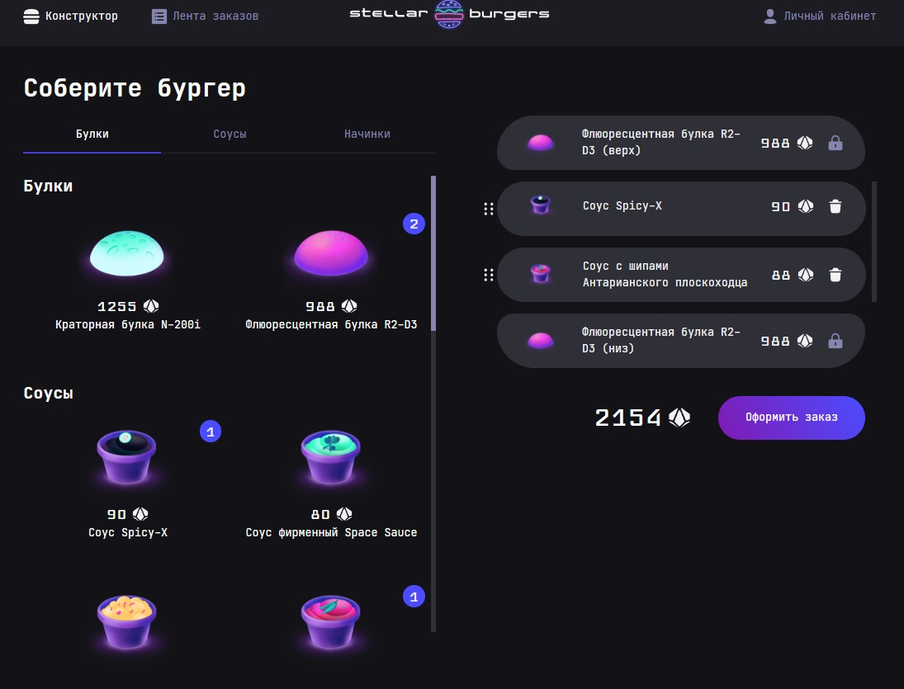
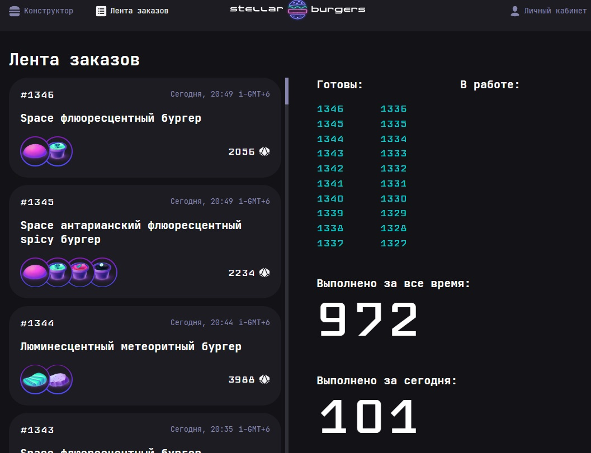
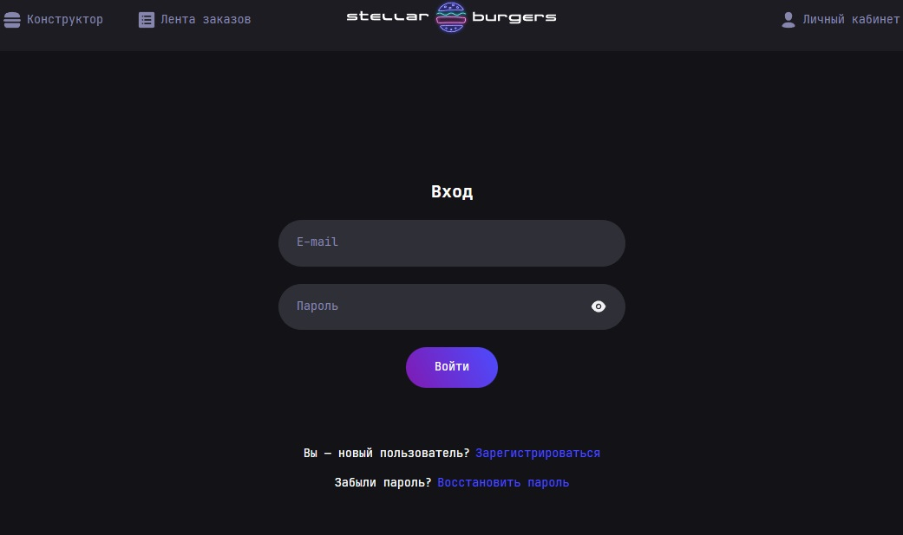
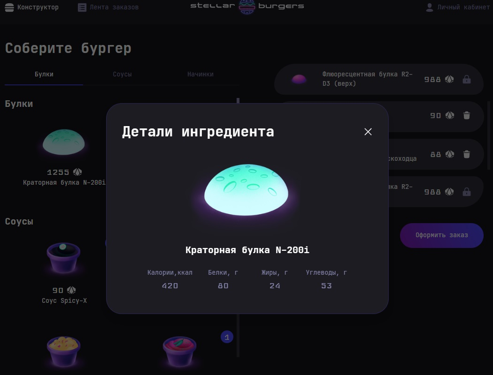

# Проект: React-Burger

## Обзор
Содержание:
* Описание
* Функциональность
* Технологии
* Планы на развитие

### Описание:
Сайт для заказа космических бургеров.

### Функциональность:
Реализован пользовательский интерфейс окна "Создания бургера": просмотр ингредиентов, просмотр заказа.
В окне создания, указаны ингредиенты бургера и цена.
В окне ингредиентов указано кол-во использованных ингредиентов. 
Используется drag&drop ингредиентов в конструктор и между начинками в конструкторе.
Можно сделать заказ (условие для этого перетащите хотябы одну булку направо).
Если закрыть заказ до того как получим ответ от сервера, можно вернуться и посмотреть результат.
Если закрыть заказ после ответа от сервера (получен № заказа / ошибка), будет оформляться новый заказ при нажатии кнопки.
Данные хранятся в сторэдже, куках и локальном хранилище.
Реализован Личный кабинет, с возможностью редактировать профиль, и выйти из аккаунта.
Реализован вход в систему, востановление пароля, регистрация пользователя.
Окна регистрации недоступны авторизованному пользователю. Личный кабинет недоступен неавторизованному пользователю.
При нажатии на оформление заказы происходит переадресация на вход в аккаунт.
Типизировано по Typescript. Сторэдж тоже реализован в Typesript.
Есть просмотр заказов во вкладке Лента заказов, в опции история заказов с личного кабинета.
Реализована возможность просмотреть подробности заказа в модальном или отдельном окне.
Согласно заданию, поиск выполнен по ID заказов, а не номеру, лимит 50 последних заказов c вебсокета, если ваш заказ не входит в список, его не выведет. Реализованы тесты.

<table><tr><td valign="top" width="25%">

</td><td valign="top" width="25%">

</td><td valign="top" width="25%">

</td><td valign="top" width="25%">

</td></tr></table>

Линк на работу https://david-arcanone.github.io/react-burger/index.html

### Технологии:
html, css, js, typescript (4.9.5), библиотека react, redux (4.2.1), react-redux (8.0.5), redux-thunk (2.4.2), react-dnd (16.0.1), react-dnd-html5-backend (16.0.1), react-router-dom (18.2.0). Применяется шрифт JetBrains Mono и Набор UI-компонентов для курсового проекта React Developer Burger Ui Components ("ya.praktikum/react-developer-burger-ui-components" 1.14.0).
Используется пакет react-intersection-observer (9.4.3) и react-custom-scrollbars-2 (4.5.0) для скролла ингредиентов в панели ингредиентов слева. Для присвоения уникальных идентификаторов используется uuid (9.0.0).
используется webpack, .nojekyll и normalize.css.

**Для разверстки и тестов применялись:** для разверстки проекта использовался gh-pages (5.0.0), тесты всех редьюсеров на js, код в папке src/services/reducers/test, Cypress (12.9.0) e2e тесты для домашней страницы в папке cypress/e2e/home.cy.js, 

### Планы на развитие:
- 💻 Реализовать верстку под мобильную версию.
- 💻 Поднять собственный сервер на Node.js.

***Выполнил Григорьев Давид 2023***
